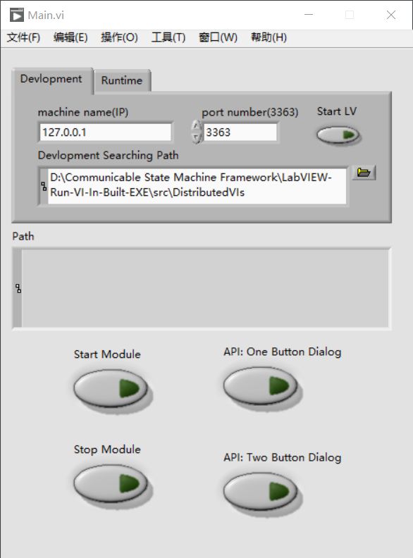

LabVIEW 范例：在 EXE中调用VI

 - 情况1： VI处于开发模式，需要运行 LabVIEW.exe, 使用VI Server运行VI

[使用VI Server远程执行VI](https://knowledge.ni.com/KnowledgeArticleDetails?id=kA03q000000xCLsCAM&l=zh-CN)

 - 情况2： VI通过Source Distribution发布后，直接使用路径异步调用运行即可。

[Calling a LabVIEW VI by Reference](https://www.ni.com/en/support/documentation/supplemental/06/calling-a-labview-vi-by-reference.html)